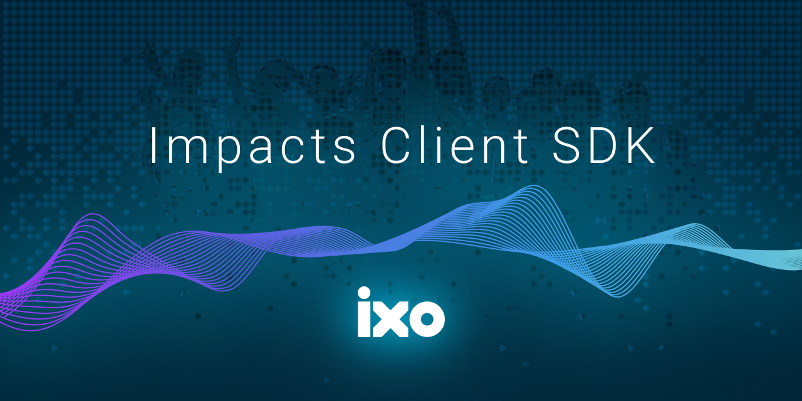

# @ixo/impactxclient-sdk


[](https://discord.com/invite/ixo) [](https://t.me/ixonetwork)
[](https://twitter.com/ixoworld)
[](https://medium.com/ixo-blog)

<p align="center">
  
</p>

<br />

<h2 align="center">
    The ultimate utility client for the ixo Blockchain.
</h2>

<br />

## Table of contents

- [@ixo/impactxclient-sdk](#ixoimpactxclient-sdk)
  - [Table of contents](#table-of-contents)
  - [Install](#install)
  - [Usage](#usage)
    - [RPC Clients](#rpc-clients)
    - [Composing Messages](#composing-messages)
      - [IBC Messages](#ibc-messages)
    - [Contracts](#contracts)
    - [Utility Functions](#utility-functions)
    - [Custom Queries](#custom-queries)
  - [Connecting with Wallets and Signing Messages](#connecting-with-wallets-and-signing-messages)
    - [Initializing the Stargate Client](#initializing-the-stargate-client)
    - [Creating Signers](#creating-signers)
    - [Amino Signer](#amino-signer)
    - [Proto Signer](#proto-signer)
    - [Broadcasting Messages](#broadcasting-messages)
  - [Developing](#developing)
    - [Codegen](#codegen)
    - [Publishing](#publishing)
- [BigInt React Native](#bigint-react-native)
  - [Credits](#credits)
  - [Disclaimer](#disclaimer)

<br />

## Install

```sh
npm install @ixo/impactxclient-sdk

yarn add  @ixo/impactxclient-sdk
```

## Usage

### RPC Clients

```js
import { ixo, createQueryClient } from "@ixo/impactxclient-sdk";

// BELOW METHOD NOT IMPLEMENTED YET!
// const { createRPCQueryClient } = ixo.ClientFactory;
// const client = await createRPCQueryClient({ rpcEndpoint: RPC_ENDPOINT });

// now you can query the cosmos modules
// const balance = await client.cosmos.bank.v1beta1.allBalances({
//   address: "ixo1addresshere",
// });

We added a custom queryClient that includes the cosmos modules and ixo modules as well as custom queries

const queryClient = await createQueryClient(RPC_ENDPOINT);

// now you can query any module
const balance = await client.cosmos.bank.v1beta1.allBalances({
  address: "ixo1addresshere",
});

// you can also query the ixo modules.
const balances = await client.ixo.exchange.v1beta1.exchangeBalances();


```

### Composing Messages

Import the `ixo` object from `@ixo/impactxclient-sdk`.

```js
import { ixo } from "@ixo/impactxclient-sdk";

// BELOW METHOD NOT IMPLEMENTED YET! READ COMMENT BELOW
// const { createSpotLimitOrder, createSpotMarketOrder, deposit } =
//   ixo.exchange.v1beta1.MessageComposer.withTypeUrl;
```

Because of the current structure of ixo's blockchain, we had to modify the telescope generation of ts files, thus the above example wont work. You can define a message using the types from the namespace itself and not from the MessageComposer, eg:

```js
import { ixo } from "@ixo/impactxclient-sdk";

const message = {
  typeUrl: "/ixo.iid.v1beta1.MsgCreateIidDocument",
  value: ixo.iid.v1beta1.MsgCreateIidDocument.fromPartial({
    id: did,
    verifications: [
      ixo.iid.v1beta1.Verification.fromPartial({
        relationships: ["authentication"],
        method: ixo.iid.v1beta1.VerificationMethod.fromPartial({
          id: did,
          type: "EcdsaSecp256k1VerificationKey2019",
          publicKeyMultibase: "F" + toHex(pubkey),
          controller: controller,
        }),
      }),
    ],
    signer: address,
    controllers: [did],
  }),
};
```

Please have a look at the tests folder to see examples of all the messages and how to format!

#### IBC Messages

Same note from [Composing Messages](#composing-messages) above apply about msg creation

```js
import { ibc } from "@ixo/impactxclient-sdk";

// DESTRUCTURE MSG FROM NAMESPACE INSTEAD OF USING MessageComposer
// const { transfer } = ibc.applications.transfer.v1.MessageComposer.withTypeUrl;
```

### Contracts

To work with a cosmwasm contract, you first need to instantiate it with the contract code and other instantiation data. The contract code is provided by the contract namespace in custom queries. After instantiation, you receive the contract's address as a response, which you must use to execute any further transactions on the contract.

Here is an example code snippet that shows how to instantiate and execute messages on a contract using the ixo1155 contract code:

```js
import { createSigningClient, customQueries, cosmwasm, cosmos } from '@ixo/impactxclient-sdk';

// create a signing client
const client = await createSigningClient(rpc, offlineSigner);

// get user account info
const account = {};
const myAddress = account.address;

// get contract code to instantiate - using ixo1155 for this example
const contractCodes = customQueries.contract.getContractCodes('devnet', 'ixo');
const contractCode = contractCodes.find((contract) => contract.name === 'ixo1155');

// instantiate the contract
const instantiateContractMessage = {
  typeUrl: '/cosmwasm.wasm.v1.MsgInstantiateContract',
  value: cosmwasm.wasm.v1.MsgInstantiateContract.fromPartial({
    admin: myAddress,
    codeId: contractCode.code,
    funds: [
      cosmos.base.v1beta1.Coin.fromPartial({
        amount: '1',
        denom: 'uixo',
      }),
    ],
    label: account.did + 'contract' + contractCode.code,
		msg: new Uint8Array(Buffer.from(JSON.stringify({
      minter: myAddress
    }))),
    sender: myAddress,
  }),
};

const instantiateContractResponse = await client.signAndBroadcast(
  myAddress,
  [instantiateContractMessage],
  "auto"
);
const contractAddress = JSON.parse(instantiateContractResponse.rawLog!)[0]
  .events
  .instantiate
  .attributes
  ._contract_address
  .value;

// execute messages on the contract
const tokenId = 'CARBON:bafybeib22s3lyz3guicawoboeieltpyewkdnuuheklpeu3zbrwekmpdew5';
const executeContractMessage = {
  typeUrl: '/cosmwasm.wasm.v1.MsgExecuteContract',
  value: cosmwasm.wasm.v1.MsgExecuteContract.fromPartial({
    contract: contractAddress,
    funds: [
      cosmos.base.v1beta1.Coin.fromPartial({
        amount: '1',
        denom: 'uixo',
      }),
    ],
		msg: new Uint8Array(Buffer.from(JSON.stringify({
      batch_mint: {
        to: myAddress,
        batch: [[tokenId, '5000', 'uri']],
      },
    }))),
    sender: myAddress,
  }),
};

const executeContractResponse = await client.signAndBroadcast(
  myAddress,
  [executeContractMessage],
  "auto"
);
```

### Utility Functions

Import the `utils` object from `@ixo/impactxclient-sdk`.
From that you can destructure utlity functions to help with using the sdk.

```js
import { utils } from "@ixo/impactxclient-sdk";

const conversionUtils = utils.conversions;
const didUtils = utils.did;
const mnemonicUtils = utils.mnemonic;
const addressUtils = utils.address;
```

### Custom Queries

Import the `customQueries` object from `@ixo/impactxclient-sdk`.
From that you can destructure `chain` functions that will fetch the latest chain info from the cosmos chain registry or request an active RPC endpoint. You can also use the `currency` functions that will allow you to get the token info based on the provided denom or the `contract` functions that will provide ixo or daodao contract codes for instatiation.

```js
import { customQueries } from "@ixo/impactxclient-sdk";

// fetch chain info based on chain name and chain network (default mainnet)
const registryChainInfo = customQueries.chain.getRegistryChainInfo(
  "impacthub",
  "testnet"
);
// request an active RPC endpoint based on registry chain info
const activeRpc =
  customQueries.chain.getActiveRpcFromRegistryChainInfo(chainInfo);
// or request an active RPC endpoint based on chain name and chain network (default mainnet)
const activeRpc = customQueries.chain.getActiveRpcFromChainName(
  "impacthub",
  "testnet"
);
// fetch chain info based on Keplr's preferred format using registry chain info
const keplrChainInfo =
  customQueries.chain.getKeplrChainInfoFromRegistryChainInfo(chainInfo);
// or fetch Keplr chain info using chain name and chain network (default mainnet)
const keplrChainInfo = customQueries.chain.getKeplrChainInfo(
  "impacthub",
  "testnet"
);

// get token info based on denom (coinMinimalDenom)
const token = customQueries.currency.findTokenFromDenom("uixo");

// get ibc token info based on ibc hash (and instantiated query client)
const ibcToken = await customQueries.currency.findIbcTokenFromHash(
  queryClient,
  "ibc/u05AC4BBA78C5951339A47DD1BC1E7FC922A9311DF81C85745B1C162F516FF2F1"
);
// `findIbcTokensFromHashes` requires an array of hashes to fetch multiple ibc token infos

// get daodao contract codes (for devnet) to instatiate
const contractCodes = customqQueries.contract.getContractCodes(
  "devnet",
  "daodao"
); // contractCodes = [{ name: "dao_core", code: 3 }, ...];
const { code } = contractCodes.find((contract) => contract.name === "dao_core");
```

## Connecting with Wallets and Signing Messages

Here are the docs on [creating signers](https://github.com/cosmology-tech/cosmos-kit/tree/main/packages/react#signing-clients) in cosmos-kit that can be used with Keplr and other wallets.

### Initializing the Stargate Client

We added a custom Stargate Signing Client that can be exported and creatable under createSigningClient, please note it only support Direct Proto signing through the rpc endpoint! It already has all the proto defininitions in the registry for ixo modules.

```js
import { createSigningClient } from "@ixo/impactxclient-sdk";

const signingClient = await createSigningClient(RPC_URL, offlineWallet);
```

THE FOLLOWING IS JUST ADVICE AS YOU CAN INSTEAD USE THE createSigningClient AS DESCRIBED ABOVE</br>
Use `getSigningixoClient` to get your `SigningStargateClient`, with the proto/amino messages full-loaded. No need to manually add amino types, just require and initialize the client:

```js
import { getSigningixoClient } from "@ixo/impactxclient-sdk";

const stargateClient = await getSigningixoClient({
  rpcEndpoint,
  signer, // OfflineSigner
});
```

### Creating Signers

To broadcast messages, you can create signers with a variety of options:

- [cosmos-kit](https://github.com/cosmology-tech/cosmos-kit/tree/main/packages/react#signing-clients) (recommended)
- [keplr](https://docs.keplr.app/api/cosmjs.html)
- [cosmjs](https://gist.github.com/webmaster128/8444d42a7eceeda2544c8a59fbd7e1d9)

### Amino Signer

THE CURRENT SDK DOES NOT INCLUDE AMINO TYPES< PLEASE USE ONLY PROTO FOR NOW</br>
Likely you'll want to use the Amino, so unless you need proto, you should use this one:

```js
import { getOfflineSignerAmino as getOfflineSigner } from "cosmjs-utils";
```

### Proto Signer

```js
import { getOfflineSignerProto as getOfflineSigner } from "cosmjs-utils";
```

WARNING: NOT RECOMMENDED TO USE PLAIN-TEXT MNEMONICS. Please take care of your security and use best practices such as AES encryption and/or methods from 12factor applications.

```js
import { chains } from "chain-registry";

const mnemonic =
  "unfold client turtle either pilot stock floor glow toward bullet car science";
const chain = chains.find(({ chain_name }) => chain_name === "ixo");
const signer = await getOfflineSigner({
  mnemonic,
  chain,
});
```

### Broadcasting Messages

Now that you have your `stargateClient`, you can broadcast messages:

DESTRUCTURE MSG FROM NAMESPACE INSTEAD OF USING MessageComposer AS DESCRIBED IN [Composing Messages](#composing-messages)</br>
The `stargateClient.signAndBroadcast(address, [msg], fee)` can still be used as in example

```js
const { send } = cosmos.bank.v1beta1.MessageComposer.withTypeUrl;

const msg = send({
  amount: [
    {
      denom: "coin",
      amount: "1000",
    },
  ],
  toAddress: address,
  fromAddress: address,
});

const fee: StdFee = {
  amount: [
    {
      denom: "coin",
      amount: "864",
    },
  ],
  gas: "86364",
};
const response = await stargateClient.signAndBroadcast(address, [msg], fee);
```

## Developing

When first cloning the repo:

```
yarn
yarn build
```

### Codegen

Contract schemas live in `./contracts`, and protos in `./proto`. Look inside of `scripts/codegen.js` and configure the settings for bundling your SDK and contracts into `ixo-multiclient-sdk`:

```
yarn codegen
```

### Publishing

Build the types and then publish:

```
yarn build:ts
yarn publish
```

#React-Native

Install the below Library and import into your main app entry file. This ensures the required Polyfils are covered on mobile.

```
yarn add @walletconnect/react-native-compat
```

# BigInt React Native

To ensure no issues with the React Native bigInt implementation, be sure to wrap your decimal gas amounts and others in a JS Double.

## Credits

🛠 Built using Telescope from Cosmology.

## Disclaimer

AS DESCRIBED IN THE LICENSES, THE SOFTWARE IS PROVIDED “AS IS”, AT YOUR OWN RISK, AND WITHOUT WARRANTIES OF ANY KIND.

No developer or entity involved in creating this software will be liable for any claims or damages whatsoever associated with your use, inability to use, or your interaction with other users of the code or software using the code, including any direct, indirect, incidental, special, exemplary, punitive or consequential damages, or loss of profits, cryptocurrencies, tokens, or anything else of value.
