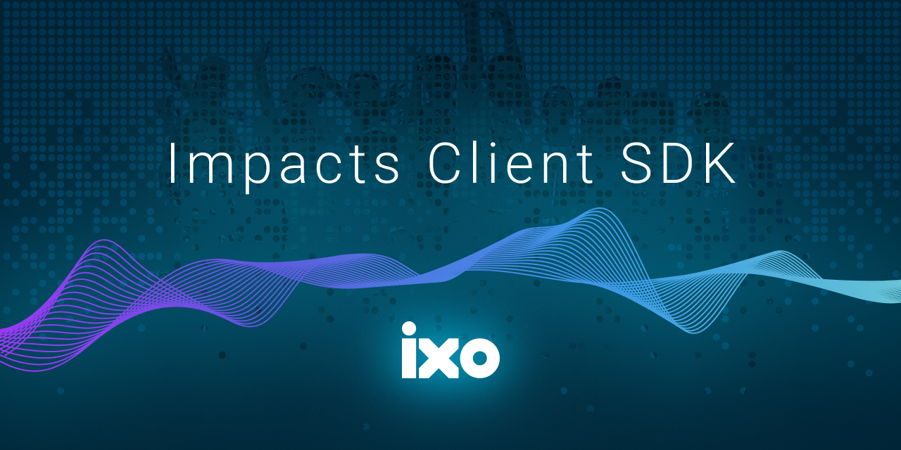

# README

## IXO Impacts Client SDK



@ixo/impactxclient-sdk

 

  

[](https://discord.com/invite/ixo) [](https://t.me/ixonetwork) [](https://twitter.com/ixoworld) [](https://medium.com/ixo-blog)

## The ultimate utility client for the IXO Blockchain

The IXO Impacts Client SDK `@ixo/impactxclient-sdk` is a type-safe TypeScript SDK for Javascript developers. It is compatible with most Javascript frameworks, including [React](https://react.dev/), [React Native](https://reactnative.dev/), [Vue.js](https://vuejs.org/), and [Node.js](https://nodejs.org/en). The Impacts Client SDK is designed to interact with the IXO blockchain and other Cosmos appchains. It provides a comprehensive set of tools to query a Cosmos blockchain, form messages, and sign transactions. The SDK also supports interchain communication and smart contract interactions. The Impacts Client SDK provides support for both [ESM (ECMAScript Modules)](https://en.wikipedia.org/wiki/ECMAScript) and [CJS (CommonJS)](https://en.wikipedia.org/wiki/CommonJS).

### Table of Contents

* [The ultimate utility client for the IXO Blockchain](./#the-ultimate-utility-client-for-the-ixo-blockchain)
  * [Table of Contents](./#table-of-contents)
  * [Key Features](./#key-features)
  * [API](./#api)
  * [Getting Started](./#getting-started)
    * [Prerequisites](./#prerequisites)
    * [Installation](./#installation)
  * [Import Strategies & Bundle Size](./#import-strategies--bundle-size)
  * [Usage](./#usage)
    * [Utility Functions](./#utility-functions)
    * [RPC Client](./#rpc-client)
    * [Query Client](./#query-client)
      * [Custom Queries](./#custom-queries)
    * [Signing Client](./#signing-client)
      * [Composing Messages](./#composing-messages)
        * [Composing IBC Messages](./#composing-ibc-messages)
      * [Signing Messages](./#signing-messages)
        * [Initializing the Stargate Client](./#initializing-the-stargate-client)
        * [Creating Signers](./#creating-signers)
      * [Broadcasting Messages](./#broadcasting-messages)
    * [Cloudflare Workers](./#cloudflare-workers)
    * [Blockchain Modules](./#blockchain-modules)
      * [IXO Modules](./#ixo-modules)
        * [IIDs](./#iids)
        * [Entities](./#entities)
        * [Tokens](./#tokens)
        * [Claims](./#claims)
        * [Bonds](./#bonds)
      * [Cosmos Modules](./#cosmos-modules)
    * [Smart Contracts](./#smart-contracts)
      * [CosmWasm](./#cosmwasm)
      * [Swap Contract](./#swap-contract)
      * [DAODAO Contracts](./#daodao-contracts)
    * [Notes](./#notes)
      * [React Native](./#react-native)
        * [BigInt React Native](./#bigint-react-native)
      * [Bundle size & tree-shaking](./#bundle-size--tree-shaking)
      * [Attributions](./#attributions)
  * [How to contribute to the Impacts Client SDK](./#how-to-contribute-to-the-impacts-client-sdk)
    * [Set up your local environment](./#set-up-your-local-environment)
    * [Codegen](./#codegen)
    * [Publishing](./#publishing)
  * [License](./#license)

### Key Features

* Easy-to-use API for querying and transacting with the IXO blockchain
* Wallet integration for secure transactions
* Custom queries to simplify complex queries
* Support for smart contracts
* Integrates interchain communications
* Supports multiple Cosmos chains
* Dual ESM + CommonJS build with `"sideEffects": false` for [tree-shakeable, small frontend/Worker bundles](./#import-strategies--bundle-size)
* First-class Cloudflare Workers support (atomic sequence management via a Durable Object)

### API

* [Import Strategies & Bundle Size](./#import-strategies--bundle-size)
* [Query Client](./#query-client)
* [Signing Client](./#signing-client)
* [Cloudflare Workers](./#cloudflare-workers)
* [Blockchain Modules](./#blockchain-modules)
* [Smart Contracts](./#smart-contracts)
* [Inter-Blockchain Communication](./#composing-ibc-messages)
* [Utility Functions](./#utility-functions)

### Getting Started

#### Prerequisites

* [Node.js](https://nodejs.org/en) **v22 or higher** — the crypto stack (`@cosmjs` 0.39 → `@noble`/`@scure`) uses APIs that only ship in Node 22+.
* [TypeScript](https://www.typescriptlang.org/) **5.7 or higher** if you consume the types (CosmJS binary types now carry `Uint8Array<ArrayBuffer>` generics).
* `moduleResolution` set to `bundler`, `node16`, or `nodenext` in your `tsconfig.json` (the SDK ships an [`exports` map](https://nodejs.org/api/packages.html#exports); the legacy `node`/`node10` resolver cannot read it).
* A package manager — [npm](https://www.npmjs.com/), [yarn](https://yarnpkg.com/), or [pnpm](https://pnpm.io/).

#### Installation

```bash
npm install @ixo/impactxclient-sdk
# or
yarn add @ixo/impactxclient-sdk
# or
pnpm add @ixo/impactxclient-sdk
```

The package ships three artifacts, selected automatically by your toolchain via the `exports` map:

| Format    | Path      | Used by                                                            |
| --------- | --------- | ------------------------------------------------------------------ |
| **ESM**   | `module/` | bundlers (Vite, webpack, esbuild, Rollup), modern `import` in Node |
| **CJS**   | `main/`   | `require()`, Jest, older Node tooling                              |
| **Types** | `types/`  | TypeScript                                                         |

`"sideEffects": false` is declared, so bundlers tree-shake unused modules. See [Import Strategies & Bundle Size](./#import-strategies--bundle-size) for how to keep bundles small.

### Import Strategies & Bundle Size

This SDK wraps the full IXO + Cosmos + IBC + CosmWasm proto surface, so **how you import matters a lot** for frontend and Cloudflare Worker bundle sizes. There are three tiers, from smallest to largest.

> All sizes below are esbuild, minified / gzipped, measured against a real bundle. Reproduce them yourself with the harness in [`treeshake-test/`](treeshake-test/).

#### 1. Granular subpaths — smallest, recommended for frontends & Workers

Import a single generated module directly. The bundler pulls in only that message/query and its proto dependencies — nothing else.

```ts
// one message type — ~45 KB / 14 KB gzip, fully typed
import { MsgCreateIidDocument } from "@ixo/impactxclient-sdk/codegen/ixo/iid/v1beta1/tx";

const msg = MsgCreateIidDocument.fromPartial({ id: did, signer: address });
```

```ts
// a slim, hand-composed query client — ~461 KB / 128 KB gzip
// createRpc is stargate-free; add only the query modules you actually use
import { createRpc } from "@ixo/impactxclient-sdk/queries";
import { QueryClientImpl as IidQuery } from "@ixo/impactxclient-sdk/codegen/ixo/iid/v1beta1/query.rpc.Query";
import { QueryClientImpl as BankQuery } from "@ixo/impactxclient-sdk/codegen/cosmos/bank/v1beta1/query.rpc.Query";

const rpc = await createRpc(RPC_ENDPOINT);
const iid = new IidQuery(rpc);
const bank = new BankQuery(rpc);

const doc = await iid.iidDocument({ id: did });
const balance = await bank.balance({ address, denom: "uixo" });
```

Available subpaths (all typed): `@ixo/impactxclient-sdk/codegen/**`, `/utils`, `/queries`, `/messages`, `/custom_queries`, `/stargate_client`, `/cloudflare`.

#### 2. Namespace imports — convenient, medium/large

The documented `ixo.` / `cosmos.` / `cosmwasm.` / `ibc.` namespaces are runtime objects that aggregate an entire proto tree, so touching one pulls in that whole tree. Fine for Node backends; heavy for browsers.

```ts
// convenient, but ~2,667 KB / 402 KB gzip because `ixo` aggregates all ixo modules
import { ixo } from "@ixo/impactxclient-sdk";
const msg = ixo.iid.v1beta1.MsgCreateIidDocument.fromPartial({ id: did });
```

Prefer strategy 1 in hot frontend/Worker paths; use namespaces freely in scripts and backends where bundle size is irrelevant.

#### 3. Full clients — largest, unavoidable when you need everything

```ts
import { createSigningClient } from "@ixo/impactxclient-sdk"; // ~1,836 KB / 303 KB gzip
import { createQueryClient } from "@ixo/impactxclient-sdk";   // ~1,223 KB / 221 KB gzip
```

`createSigningClient` carries a registry of **every** chain message type (that is the point of it) plus `cosmjs-types`, so it is inherently large. `createQueryClient` instantiates every module's query client. Both are the right choice for a Node backend or a dApp that touches many modules; for a Worker or a focused frontend, prefer the slim composition in strategy 1.

#### Size cheat-sheet

| What you import                            | min / gzip        | Best for                     |
| ------------------------------------------ | ----------------- | ---------------------------- |
| One msg via `/codegen/**`                  | 45 KB / 14 KB     | frontends, Workers           |
| Slim query client (`createRpc` + subpaths) | 461 KB / 128 KB   | query-only Workers/frontends |
| `createQueryClient` (all modules)          | 1,223 KB / 221 KB | backends, multi-module dApps |
| `createSigningClient`                      | 1,836 KB / 303 KB | signing dApps/backends       |
| `ixo` namespace only                       | 2,667 KB / 402 KB | scripts, backends            |
| `/cloudflare` (SequenceManagerDO)          | 2.8 KB / 1.2 KB   | Cloudflare Workers           |

#### Recommendations by environment

* **Cloudflare Workers / edge**: import from granular subpaths only; use `createRpc` + the specific `QueryClientImpl`s you need. Re-export the Durable Object from `@ixo/impactxclient-sdk/cloudflare` (see [Cloudflare Workers](./#cloudflare-workers)). Enable `nodejs_compat` in `wrangler.jsonc`.
* **Frontend (React/Vue/Vite)**: granular subpaths for message/query types on hot paths; a single `createSigningClient` behind a lazy `import()` if you need signing, so it is not in your initial chunk.
* **Node backend / scripts**: import whatever is convenient — namespaces and full clients are fine.

### Usage

The [Query Client](./#query-client) and [Signing Client](./#signing-client) provide simple interfaces to abstract away the complexity of querying data on the IXO blockchain and signing messages for broadcasting to the IXO blockchain. These clients also work for other Cosmos appchains.

#### Utility Functions

* `./utils`

Import the `utils` object from `@ixo/impactxclient-sdk` to destructure utlity functions to help with using this SDK.

```js
import { utils } from "@ixo/impactxclient-sdk";

const conversionUtils = utils.conversions;
const didUtils = utils.did;
const mnemonicUtils = utils.mnemonic;
const addressUtils = utils.address;
```

#### RPC Client

First connect to an RPC Client in order to interact with a blockchain; in this case the IXO blockchain.

> The [Cosmos Chain Resolver SDK](https://www.npmjs.com/package/@ixo/cosmos-chain-resolver), created by IXO, provides a simple way to retrieve RPC endpoints for any Cosmos chain.

We added a custom [Query Client](./#query-client) that includes the Cosmos modules and IXO modules, as well as [Custom Queries](./#custom-queries).

Remember to set the `RPC_ENDPOINT` environment variable.

* Published `RPC_ENDPOINT` providers can be found at the Cosmos [Chain Registry Github repository](https://github.com/cosmos/chain-registry/blob/533af67f3a21bb952189070c106859eac59e4466/impacthub/chain.json#L148) for Mainnet.
* Testnet providers are [found here.](https://github.com/cosmos/chain-registry/blob/533af67f3a21bb952189070c106859eac59e4466/testnets/impacthubtestnet/chain.json#L81)
* Providers for Devnet are [found here.](https://github.com/cosmos/chain-registry/blob/533af67f3a21bb952189070c106859eac59e4466/testnets/impacthubdevnet/chain.json#L56)

Example that describes how to set up your `queryClient` with an RPC endpoint.

```js
import { ixo, createQueryClient } from "@ixo/impactxclient-sdk";

const queryClient = await createQueryClient(RPC_ENDPOINT);
```

#### Query Client

IXO created a custom QueryClient to facilitate queries to the `cosmos` and `ixo` modules, as well as to provide [Custom Queries](./#custom-queries).

> First connect to an [RPC client](./#rpc-client).

Example code snippet assuming that the `queryClient` has been initialised with an RPC endpoint.

```js
import { ixo, createQueryClient } from "@ixo/impactxclient-sdk";

const queryClient = await createQueryClient(RPC_ENDPOINT);

// Example of querying the Cosmos Bank module for the balances of an account on the IXO blockchain
const balance = await queryClient.cosmos.bank.v1beta1.allBalances({
  address: "ixo1addresshere",
});
// Example of querying the IXO Entity module for all entities on the IXO blockchain
const entities = await queryClient.ixo.entity.v1beta1.entityList();
```

> **Bundle-size tip:** `createQueryClient` instantiates the query client for _every_ module (\~221 KB gzip). If you only query a few modules — especially in a Cloudflare Worker or frontend — compose a slim client with `createRpc` instead. See [Import Strategies & Bundle Size](./#import-strategies--bundle-size).
>
> ```ts
> import { createRpc } from "@ixo/impactxclient-sdk/queries";
> import { QueryClientImpl } from "@ixo/impactxclient-sdk/codegen/ixo/entity/v1beta1/query.rpc.Query";
>
> const rpc = await createRpc(RPC_ENDPOINT);
> const entity = new QueryClientImpl(rpc);
> const entities = await entity.entityList();
> ```

**Custom Queries**

Import the `customQueries` object from `@ixo/impactxclient-sdk`. Use the object to destructure `currency` functions that will allow you to get the token info based on the provided denom or the `contract` functions that will provide ixo or daodao contract codes for instantiation.

Example of custom queries.

```js
import { customQueries } from "@ixo/impactxclient-sdk";

// get token info based on denom (coinMinimalDenom)
const token = customQueries.currency.findTokenFromDenom("uixo");

// get ibc token info based on ibc hash (and instantiated query client)
const ibcToken = await customQueries.currency.findIbcTokenFromHash(
  queryClient,
  "ibc/u05AC4BBA78C5951339A47DD1BC1E7FC922A9311DF81C85745B1C162F516FF2F1"
);
// `findIbcTokensFromHashes` requires an array of hashes to fetch multiple ibc token infos

// get coincodex info for a coin
const coinCodexInfo = customQueries.currency.findTokenInfoFromDenom("ixo");
// `findTokensInfoFromDenoms` requires an array of denoms to fetch multiple coinCodex infos
```

```js
// get daodao contract codes (for devnet) to instatiate
const contractCodes = customQueries.contract.getContractCodes(
  "devnet",
  "daodao"
); // contractCodes = [{ name: "dao_core", code: 3 }, ...];
const { code } = contractCodes.find((contract) => contract.name === "dao_core");

// get specific contract code (for testnet) to instantiate
const daoCoreContractCode = customQueries.contract.getContractCode(
  "testnet",
  "dao_core"
);
```

#### Signing Client

A message to the IXO blockchain requires three steps:

1. [Compose Message](./#composing-messages)
2. [Sign Message](./#signing-messages)
3. [Broadcast Message](./#broadcasting-messages)

See **Note**

> IXO has developed an improved signing client named SignX that interacts seamlessly with the [Impacts X mobile app](https://mobile.ixo.world/). Read more about how to utilise [the SignX client](https://github.com/ixofoundation/ixo-signx) instead of using this SigningClient.

**Composing Messages**

The following example describes one type of message. Reference the `__tests__` directory of this repository for further examples of most messages and how to format them.

```js
import { ixo } from "@ixo/impactxclient-sdk";

const message = {
  typeUrl: "/ixo.iid.v1beta1.MsgCreateIidDocument",
  value: ixo.iid.v1beta1.MsgCreateIidDocument.fromPartial({
    id: did,
    verifications: [
      ixo.iid.v1beta1.Verification.fromPartial({
        relationships: ["authentication"],
        method: ixo.iid.v1beta1.VerificationMethod.fromPartial({
          id: did,
          type: "EcdsaSecp256k1VerificationKey2019",
          publicKeyMultibase: "F" + toHex(pubkey),
          controller: controller,
        }),
      }),
    ],
    signer: address,
    controllers: [did],
  }),
};
```

**Composing IBC Messages**

> Reference [Composing Messages](./#composing-messages) for information about composing messages in general.

* `./codegen/ibc/bundle`

```js
import { ibc } from "@ixo/impactxclient-sdk";
```

**Signing Messages**

Here are the docs on [creating signers](https://github.com/cosmology-tech/cosmos-kit/tree/main/packages/react#signing-clients) in cosmos-kit that can be used with Keplr and other wallets.

**Initializing the Stargate Client**

IXO ships a custom Stargate signing client, created via `createSigningClient`. It comes pre-loaded with the full IXO + Cosmos + IBC + CosmWasm registry, so you do **not** need to register proto types manually.

Note

> Signing defaults to `SIGN_MODE_DIRECT` (proto). If the wallet you pass is an amino signer (e.g. Ledger via `Secp256k1HdWallet`), the client automatically falls back to `SIGN_MODE_LEGACY_AMINO_JSON` — provide `aminoTypes` in the options for any custom messages that need amino JSON.

```ts
import { createSigningClient } from "@ixo/impactxclient-sdk";

// createSigningClient(rpcEndpoint, offlineWallet, ignoreGetSequence?, options?, localStoreFunctions?)
const signingClient = await createSigningClient(RPC_ENDPOINT, offlineWallet);
```

With gas price and a local sequence store (recommended for apps sending back-to-back transactions):

```ts
import { createSigningClient } from "@ixo/impactxclient-sdk";
import { GasPrice } from "@cosmjs/stargate";
import store from "store"; // or any get/set-backed storage

const signingClient = await createSigningClient(
  RPC_ENDPOINT,
  offlineWallet,
  false,
  { gasPrice: GasPrice.fromString("0.025uixo") },
  {
    getLocalData: (k) => store.get(k),
    setLocalData: (k, d) => store.set(k, d),
  }
);
```

**Creating Signers**

`createSigningClient` accepts any CosmJS `OfflineSigner`. Common ways to get one:

* Browser wallets — [cosmos-kit](https://docs.cosmoskit.com/) (recommended), or [Keplr](https://docs.keplr.app/api/cosmjs.html) directly.
* From a mnemonic — CosmJS `DirectSecp256k1HdWallet` (a direct dependency of this SDK, no extra install).

WARNING

> Never hard-code a _mnemonic_ / _seed phrase_ in plain text. The example below is illustration only and holds no balances. Use secure storage / encryption in production.

```ts
import { DirectSecp256k1HdWallet } from "@cosmjs/proto-signing";

const mnemonic =
  "unfold client turtles either pilots stocks floors glow toward bullets cars science";
const offlineWallet = await DirectSecp256k1HdWallet.fromMnemonic(mnemonic, {
  prefix: "ixo",
});
```

> For ed25519 keys and DID helpers, the SDK's own signer utilities under `@ixo/impactxclient-sdk/utils` (`utils.mnemonic`, `utils.did`) generate IXO-native addresses and DIDs. See [Utility Functions](./#utility-functions).

**Broadcasting Messages**

Now that you have your `stargateClient`, you can broadcast messages that were composed as described in [Composing Messages](./#composing-messages). This example demonstrates broadcasting the `/cosmos.bank.v1beta1.MsgSend` message.

```js
const msg = send({
  amount: [
    {
      denom: "coin",
      amount: "1000",
    },
  ],
  toAddress: address,
  fromAddress: address,
});

const fee: StdFee = {
  amount: [
    {
      denom: "coin",
      amount: "864",
    },
  ],
  gas: "86364",
};
const response = await stargateClient.signAndBroadcast(address, [msg], fee);
```

#### Cloudflare Workers

The SDK runs on Cloudflare Workers. Enable `nodejs_compat` in `wrangler.jsonc` and import from granular subpaths to keep the Worker small (see [Import Strategies & Bundle Size](./#import-strategies--bundle-size)).

When multiple Workers sign transactions from the **same account** concurrently they race for the account sequence number. The SDK ships a Durable Object, `SequenceManagerDO`, that hands out sequence numbers atomically. Import it from the dedicated `/cloudflare` subpath (which avoids loading crypto at module-load time).

1. Re-export the Durable Object from your Worker:

```ts
// Use the /cloudflare subpath — tiny (~1.2 KB gzip) and crypto-free at load time
export { SequenceManagerDO } from "@ixo/impactxclient-sdk/cloudflare";
```

2. Bind it in `wrangler.jsonc`:

```jsonc
{
  "durable_objects": {
    "bindings": [{ "name": "SEQUENCE_MANAGER", "class_name": "SequenceManagerDO" }]
  },
  "migrations": [{ "tag": "v1", "new_classes": ["SequenceManagerDO"] }]
}
```

3. Wire it into the signing client via `createDOStoreFunctions`:

```ts
import { createSigningClient, createDOStoreFunctions } from "@ixo/impactxclient-sdk";

const doStub = env.SEQUENCE_MANAGER.get(env.SEQUENCE_MANAGER.idFromName("global"));
const storageFunctions = createDOStoreFunctions(doStub);

const client = await createSigningClient(rpc, wallet, false, options, storageFunctions);
await client.signAndBroadcast(address, msgs, "auto", memo);
```

Tune the inter-transaction stagger with the `IXO_CLIENT_SEQUENCE_MIN_DELAY_MS` Worker var (default `400`).

#### Blockchain Modules

**IXO Modules**

Available at the [IXO Blockchain](https://github.com/ixofoundation/ixo-blockchain) repository.

See [potential use cases](USE_CASES.md#ixo-modules) that may be applicable to your application.

* `./codegen/ixo/bundle.d.ts`

**IIDs**

The [IID (Interchain Identifier) Module](https://github.com/ixofoundation/ixo-blockchain/tree/a161b2ef40ca56dd066bc0b1eb21913174c65b89/x/iid) establishes a decentralized identity mechanism, ensuring a standardized approach for all entities within the system. By harnessing the power of DIDs (Decentralized Identifiers) and IIDs, this module facilitates a robust, secure, and universally recognizable identity framework, paving the way for a seamless integration across various platforms and networks.

* `./codegen/ixo/iid/v1beta1/query`
* `./codegen/ixo/iid/v1beta1/tx`

**Entities**

The [Entity Module](https://github.com/ixofoundation/ixo-blockchain/tree/a161b2ef40ca56dd066bc0b1eb21913174c65b89/x/entity) introduces a holistic approach to NFT-backed identities, bridging the gap between decentralized identifiers and tangible assets. Upon entity creation, a symbiotic relationship forms between an IID Document, an NFT, and the Entity's metadata. Further enriched with the concept of Entity Accounts, this module ensures a seamless transition of ownership, while offering a robust framework for entities to operate within a decentralized landscape.

* `./codegen/ixo/entity/v1beta1/query`
* `./codegen/ixo/entity/v1beta1/tx`

**Tokens**

Embracing the versatility of the EIP-1155 standard, the [Token Module](https://github.com/ixofoundation/ixo-blockchain/tree/a161b2ef40ca56dd066bc0b1eb21913174c65b89/x/token) offers a sophisticated mechanism for managing multi-token smart contracts. Whether you're dealing with fungible or non-fungible tokens, this module streamlines the process of creation, minting, and management. From defining token collections to ensuring transparent on-chain token attributes, the Token Module stands as a beacon of efficiency and flexibility in the decentralized token ecosystem.

* `./codegen/ixo/token/v1beta1/query`
* `./codegen/ixo/token/v1beta1/tx`

**Claims**

The [Claims Module](https://github.com/ixofoundation/ixo-blockchain/tree/a161b2ef40ca56dd066bc0b1eb21913174c65b89/x/claims) provides an advanced structure for handling Verifiable Claims (VCs), cryptographic attestations regarding a subject. By aligning with the W3C standard and incorporating unique IXO system identifiers, this module offers a comprehensive solution for creating, evaluating, and managing claims. It enables entities to define protocols, authorize agents, and maintain a verifiable registry, ensuring authenticity and transparency in all claim-related processes.

* `./codegen/ixo/claims/v1beta1/query`
* `./codegen/ixo/claims/v1beta1/tx`

**Bonds**

The [Bonds Module](https://github.com/ixofoundation/ixo-blockchain/tree/a161b2ef40ca56dd066bc0b1eb21913174c65b89/x/bonds) provides universal token bonding curve functions to mint, burn or swap any token in a Cosmos blockchain.

* `./codegen/ixo/bonds/v1beta1/query`
* `./codegen/ixo/bonds/v1beta1/tx`

> **⚠️ Disabled on IXO mainnet (v8):** as of the v8 upgrade the bonds module is intentionally disabled on-chain (emergency security measure). Bonds **queries** still work, but any state-changing bonds message (`MsgCreateBond`, `MsgBuy`, `MsgSell`, …) is rejected by the chain with `the bonds module is disabled` (this surfaces as a thrown `BroadcastTxError`, not a failed-tx response). The proto types remain in the SDK for decoding historical data and for chains where the module is enabled.

**Cosmos Modules**

Available at the [Cosmos SDK](https://github.com/cosmos/cosmos-sdk) repository. View the [examples provided](https://docs.cosmos.network/main/build/modules) by the Cosmos SDK team.

* `./codegen/contracts`
* `./codegen/cosmos/bundle`
* `./codegen/cosmwasm/bundle`
* `./codegen/ibc/bundle`
* `./codegen/ica/bundle`
* `./codegen/ics23/bundle`
* `./codegen/tendermint/bundle`

#### Smart Contracts

In order to instantiate and execute smart contracts on the IXO blockchain, messages on the `wasm` module have to be invoked. The `wasm` message contains the smart contract details and the message to execute.

**CosmWasm**

Available at the [CosmWasm module](https://github.com/CosmWasm/wasmd) repository.

* `./codegen/cosmwasm/bundle`

There are a few steps to follow when working with a CosmWasm smart contract.

> Instantiation is only required when the contract is not available on the chain instance that you are working with.

1. See note above. Only instantiate an instance of the contract, if needed.
2. Retrieve the contract code for your target smart contract.
   * Contract code is provided by the contract namespace in custom queries.
   * `./custom_queries/contract`
3. Create the message to Execute on the contract.
4. Execute the message on the contract by signing it.

Here is an example code snippet that shows how to instantiate and execute messages on a contract using the ixo1155 contract code:

```js
import { createSigningClient, customQueries, cosmwasm, cosmos } from '@ixo/impactxclient-sdk';

/*
// Create a signing client in order to sign messages.
// Retrieve the Account Address for the connected user account.
*/
const client = await createSigningClient(rpc, offlineSigner);
const account = {};
const myAddress = account.address;

/*
// NB: Instantiation is only required when the contract is not available on the chain instance that you are working with.
// 1. Create the instantiation message for the contract.
// - Retrieve the Code for this contract (using ixo1155 for this example).
// - Remember to provide 1 uixo as message funding.
// 2. Sign the message and broadcast it to the IXO blockchain.
// - The most important part of this response is the Contract Address.
// - It is required for all further interactions with the contract.
*/
const contractCodes = customQueries.contract.getContractCodes('devnet', 'ixo');
const contractCode = contractCodes.find((contract) => contract.name === 'ixo1155');
const instantiateContractMessage = {
  typeUrl: '/cosmwasm.wasm.v1.MsgInstantiateContract',
  value: cosmwasm.wasm.v1.MsgInstantiateContract.fromPartial({
    admin: myAddress,
    codeId: contractCode.code,
    funds: [
      cosmos.base.v1beta1.Coin.fromPartial({
        amount: '1',
        denom: 'uixo',
      }),
    ],
    label: account.did + 'contract' + contractCode.code,
		msg: new Uint8Array(Buffer.from(JSON.stringify({
      minter: myAddress
    }))),
    sender: myAddress,
  }),
};

const instantiateContractResponse = await client.signAndBroadcast(
  myAddress,
  [instantiateContractMessage],
  "auto"
);
const contractAddress = JSON.parse(instantiateContractResponse.rawLog!)[0]
  .events
  .instantiate
  .attributes
  ._contract_address
  .value;

/*
// Execute messages on the contract with these steps:
// 1. All contract messages need to be wrapped in the /cosmwasm.wasm.v1.MsgExecuteContract blockchain message.
// - Remember to provide 1 uixo as message funding.
// 2. Create the message that you want to execute on the contract and include it in the msg field.
// - This example executes the batch_mint message.
// 3. Sign the message and broadcast it to the IXO blockchain.
// - A successful message execution means that the transaction was completed.
*/

// tokenId is an example in this case to support the batch_mint contract message.
const tokenId = 'CARBON:bafybeib22s3lyz3guicawoboeieltpyewkdnuuheklpeu3zbrwekmpdew5';
const executeContractMessage = {
  typeUrl: '/cosmwasm.wasm.v1.MsgExecuteContract',
  value: cosmwasm.wasm.v1.MsgExecuteContract.fromPartial({
    contract: contractAddress,
    funds: [
      cosmos.base.v1beta1.Coin.fromPartial({
        amount: '1',
        denom: 'uixo',
      }),
    ],
		msg: new Uint8Array(Buffer.from(JSON.stringify({
      batch_mint: {
        to: myAddress,
        batch: [[tokenId, '5000', 'uri']],
      },
    }))),
    sender: myAddress,
  }),
};
const executeContractResponse = await client.signAndBroadcast(
  myAddress,
  [executeContractMessage],
  "auto"
);
```

**Swap Contract**

IXO developed a smart contract named [ixoSwap](https://github.com/ixofoundation/ixo-contracts/tree/master/ixo-swap) to enable swapping of tokens on the IXO network. Read more about the contract in the [Swimm documentation.](https://github.com/ixofoundation/ixo-contracts/tree/master/.swm) The contract has been [audited by an independent party](https://github.com/oak-security/audit-reports/tree/main/ixo).

Examples of how to use the ixoSwap contract are available here:

* View [implementation examples](https://github.com/ixofoundation/ixo-multiclient-sdk/blob/26e254979175137156db8033a6c089efa4b171d5/__tests__/flows/cosmwasm.ts#L655) in the `__tests__` directory of this repository.
* Another working example is available at the Jambo repository [in this branch](https://github.com/ixofoundation/jambo/tree/develop-swap).

**DAODAO Contracts**

The basic DAO contracts are forked from the DAO-DAO Github organisation's [dao-contracts repository.](https://github.com/DA0-DA0/dao-contracts)

IXO has implemented the contracts in an innovative manner and this implementation is generally available as [DAO Tooling in the Impacts Portal](https://github.com/ixofoundation/ixo-webclient).

Examples of how to use DAODAO Contracts [can be found here](https://github.com/ixofoundation/ixo-webclient/blob/40f9c34b161d4419a1a1490f555a0ac89f10dba6/apps/web/src/components/Modals/AddActionModal/SetupAddEntityModal.tsx).

See [potential use cases](USE_CASES.md#daodao-contracts) that may be applicable to your application.

#### Notes

**React Native**

Install the below Library and import into your main app entry file. This ensures the required Polyfils are covered on mobile.

```
yarn add @walletconnect/react-native-compat
```

**BigInt React Native**

To ensure no issues with the React Native bigInt implementation, be sure to wrap your decimal gas amounts and others in a JS Double.

**Bundle size & tree-shaking**

The `treeshake-test/` folder is a self-contained harness that measures how the SDK bundles under esbuild and Rollup, verifies it loads under both Node ESM and CJS, and checks that every import style resolves types. Run it after any dependency or packaging change:

```bash
cd treeshake-test && npm install
npm run build        # bundle sizes per import strategy
npm run check:node   # Node ESM + CJS loadability
npm run check:types  # every import style resolves types
```

See [Import Strategies & Bundle Size](./#import-strategies--bundle-size) for the resulting numbers and recommendations.

**Attributions**

Types were generated from the `*.proto` files of the IXO appchain using the `@osmonauts/telescope@0.92.2` package.

> See `@ixo/impactxclient-sdk/types/index.d.ts` for the complete list of types.
>
> The generated `src/codegen/` output carries a few required manual patches (cosmjs package renames, a local `createProtobufRpcClient`, tree-shaking fixes). These are wiped by `yarn codegen` and must be re-applied — see [CODEGEN\_PATCHES.md](CODEGEN_PATCHES.md).

### How to contribute to the Impacts Client SDK

IXO welcomes contributions and comments of all kinds!

First off, thank you for applying your mind and time to improving this repo - it helps the Internet of Impacts to save our planet! Whether you are contributing in your own space-time or following a bounty; we are grateful!

1. Fork the repo.
2. Ensure that you sync the fork often.
3. Clone your fork and create a branch.
4. Implement your changes one at a time and commit regularly to your fork.
5. Once your change is completed and passes all of the local tests, create a PR.
6. Your change will be reviewed as soon as possible with helpful feedback for your further updates to the change.
7. Finally, when everything is good to go and your PR approved, you can squash and merge your branch.

#### Set up your local environment

Clone the [repository](https://github.com/ixofoundation/ixo-multiclient-sdk.git). After successfully cloning:

```
yarn
yarn build
```

#### Codegen

Contract schemas live in `./contracts`, and protos in `./proto`. Look inside of `scripts/codegen.js` and configure the settings for bundling your SDK and contracts into `ixo-multiclient-sdk`:

```
yarn codegen
```

> **⚠️ IMPORTANT:** `yarn codegen` deletes and regenerates all of `src/codegen/`, which wipes several required manual patches (cosmjs package renames, the local `protobufRpcClient`, and other bundle-size/tree-shaking fixes). After every regeneration, re-apply the patches and run the verification checklist documented in [**CODEGEN\_PATCHES.md**](CODEGEN_PATCHES.md) before publishing.

#### Publishing

Build the types and then publish:

```
yarn build:ts
yarn publish
```

### License

This SDK is licensed under the Apache 2 License. See the [LICENSE](LICENSE/) file for more information.
